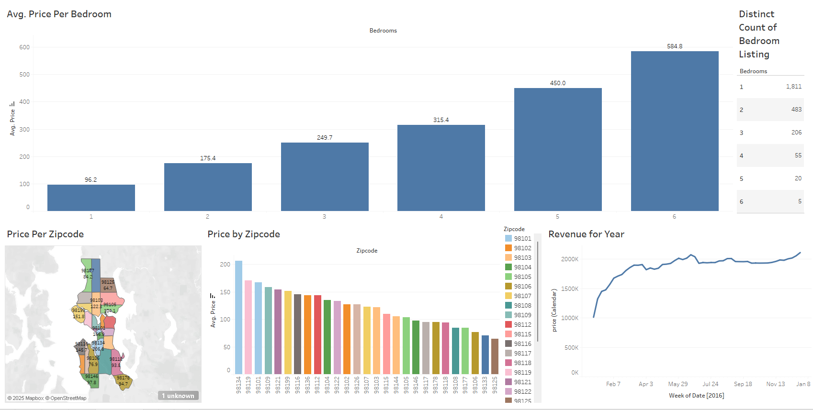

# 📊 Tableau Data Visualization Project

---

## 📝 Summary

This project uses **Tableau** to explore and visualize a dataset through an interactive dashboard. It demonstrates how powerful visuals and filtering can turn raw data into meaningful insights. The goal was to develop a clear, interactive report that's easy to explore, even for non-technical users.

---

## 🔧 What I Did

- Imported and connected the dataset in Tableau
- Cleaned and prepared data directly in Tableau 
- Created multiple visualizations:
  - Bar charts
  - Line graphs
  - Maps
- Used **filters** and **parameters** for interactivity
- Built a **dashboard** combining key visuals into a single story

---

## 📚 What I Learned

- Connecting and preparing data in Tableau
- Building effective charts that communicate key insights
- Using filters, slicers, and actions for interactive dashboards
- Designing user-friendly layouts and color schemes

---

## ✅ Result

An interactive Tableau dashboard that:
- Visualizes key trends, comparisons, and totals
- Allows users to filter and drill down into specific areas
- Presents a clean, shareable format suitable for business use

---

## 🌄 Screenshots

### 🧭 Dashboard Overview

---

## 🌱 Future Improvements

- Add tooltips with more detailed metrics
- Publish the dashboard to Tableau Public for sharing
- Explore calculated fields for deeper insights
